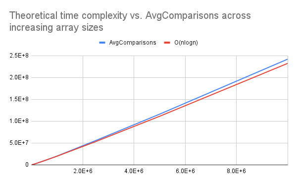
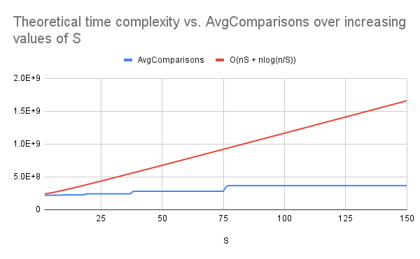

## Project 1: Integration of Merge Sort & Insertion Sort
# Hybrid Mergesort with Insertion Sort

Hybrid algorithm works by calling Merge Sort recursively, until subarrays of size ≤ $S$ are reached.  
Insertion Sort is used for subarrays of size ≤ $S$, which is efficient for small subarrays.

Thus, for $N$ elements and size $S$, there are approximately $\frac{N}{S}$ subarrays of size S.

## Time complexity (Worst case) for pure implementations of Merge Sort and Insertion Sort

- Insertion Sort: $$O(N^2)$$
- Merge Sort: $$O(N \log N)$$

## Time complexity (Worst case) for Hybrid algorithm

### For **Mergesort:**

Let $i$ be the number of iterations of Merge Sort.  
After 1 iteration: size of subarray becomes $\frac{N}{2}$  
After 2 iterations: $\frac{N}{4}$  
After 3 iterations: $\frac{N}{8}$  
After $i$ iterations: $\frac{N}{2^i}$  

Merge Sort stops when the size of the subarray reaches S, and Insertion Sort takes over.  
Thus:

$$
\frac{N}{2^i} = S \Rightarrow 2^i = \frac{N}{S} \Rightarrow i = \log_2\left(\frac{N}{S}\right)
$$

Merge cost at every level is $O(N)$  
Total cost = iterations $i \times$ merge cost at every level  
= $\log_2\left(\frac{N}{S}\right) \times N$  
= $N \log_2\left(\frac{N}{S}\right)$

Hence, time complexity is $O\left(N \log (N)\right)$

### For **Insertion Sort:**

Total comparisons for Insertion Sort = $\sum_{k=1}^{S-1} k = 1 + 2 + 3 + \dots + (S-1) = \frac{S(S-1)}{2}$

Work per array is $O(S^2)$ and total work by Insertion Sort for $\frac{N}{S}$ subarrays of size S is:

$$
\frac{N}{S} \times O(S^2) = O(N S)
$$

Hence, time complexity is $$O(N)$$

### Combined Time Complexity

Combining the two time complexities, $O(N)$ and $O\left(N \log (N)\right)$,  
the overall time complexity for the hybrid algorithm is:

$$
O\left(N + N \log (N)\right)
$$

## c(i) Plot key comparisons against number of elements N, keeping S = 20 constant[^data-note]

## c(ii) Plot key comparisons against value of S, keeping N = 10,000,000[^data-note]

## c(ii) and c(iii) Finding Optimal S Theoretically[^data-note]

To find optimal S theoretically,  

$$
Total time \ T(S) = N \log_2\left(\frac{N}{S}\right) + \frac{N}{S} \cdot \frac{S(S - 1)}{2} = N \log_2\left(\frac{N}{S}\right) + \frac{N(S - 1)}{2}
$$

### Derivative:

$$
\frac{dT}{dS} = -\frac{N}{S \ln(2)} + \frac{N}{2}
$$

Set derivative to zero to obtain optimal value of S:

$$
S = \frac{2}{\ln 2} \approx 2.885
$$

However, this is not practical as mergesort is $O(N)$ at every level, using such a small S fails to take advantage of the more efficient insertion sort for smaller arrays, thus we should find a way to determine an optimal S empirically by varying number of elements N. 

Truncated data from c(ii)

| S | AvgTime | AvgComparisons | MergesortDepth |
|---|---------|----------------|----------------|
| 2 | 0.596532961 | 220048063 | 23 |
| 3 | 0.547501305 | 220046649 | 22 |
| 4 | 0.527949559 | 220167576 | 22 |
| 5 | 0.473344248 | 221049659 | 21 |
| 6 | 0.472200302 | 221049659 | 21 |
| 7 | 0.471457619 | 221049659 | 21 |
| 8 | 0.470727275 | 221049659 | 21 |
| 9 | 0.453165044 | 223086858 | 21 |
| 10 | 0.425961703 | 226347497 | 20 |
| 11 | 0.427560463 | 226347497 | 20 |
| 17 | 0.427979548 | 226347497 | 20 |
| 18 | 0.425482524 | 226347497 | 20 |
| 19 | 0.388616915 | 240907695 | 20 |
| 20 | 0.381527093 | 242218266 | 19 |
| 21 | 0.381196156 | 242218266 | 19 |
| 36 | 0.380314749 | 242218266 | 19 |
| 37 | 0.380367153 | 242218266 | 19 |
| 38 | 0.388225180 | 275109311 | 19 |
| 39 | 0.379073287 | 281103626 | 18 |
| 40 | 0.378764288 | 281103626 | 18 |
| 74 | 0.384808358 | 281103626 | 18 |
| 75 | 0.383992793 | 281103626 | 18 |
| 76 | 0.408506981 | 341320898 | 18 |
| 77 | 0.419192985 | 367090130 | 17 |
| 78 | 0.418549490 | 367090130 | 17 |
| 148 | 0.416358673 | 367090130 | 17 |
| 149 | 0.418283272 | 367090130 | 17 |
| 150 | 0.419899635 | 367090130 | 17 |

Take the ceiling of $$\log_2\left(\frac{N}{S}\right)$$ to find Mergesort depth

We can see that, as S increases, mergesort depth correspondingly decreases at certain transition points. Just before mergesort depth decreases, the preceding increase in size S led to a significant increase in key comparisons and time taken, this is due to the increase in work done by insertion sort with a worst case of $$O(N^2)$$. 

For N=10,000,000 we can see that the most optimal S is 40. We can expect similar behaviors for other N elements, but the S value may not necessarily be the same.

Fastest execution times, for different amount of N elements. 

| S | Size | AvgTime | AvgComparisons | MergesortDepth | MaxDepth |
|---|------|---------|----------------|----------------|----------|
| 56 | 250000 | 0.008287226 | 5292770 | 13 | 18 |
| 54 | 500000 | 0.016875275 | 11086436 | 14 | 19 |
| 47 | 1000000 | 0.034217115 | 23175968 | 15 | 20 |
| 31 | 2500000 | 0.090524674 | 55562133 | 17 | 22 |
| 22 | 5000000 | 0.183665068 | 116110663 | 18 | 23 |
| 40 | 10000000 | 0.378764288 | 281103626 | 18 | 24 |

From the table above there is no unique S that works for any N elements. However we can see that when size S reduces MergesortDepth by about 5 to 6 from the MaxDepth of Mergesort it generally leads to the fastest execution of the algorithm, thus optimal S is any size S (32 to 64) that reduces MergesortDepth by 5 to 6, where MaxDepth refers to the depth of Mergesort alone, without using insertion sort.

However empirically, S= [32,64] is not always true, and it is a general guideline, due to difference during runtime S could sometimes deviate slightly from this range, but the general idea still holds.

## d) Comparing with original mergesort 
|Algorithm | S | AvgTime | AvgComparisons |
|-------------------------|---|---------|----------------|
| Merge and Insertion Sort | 10000000 | 0.379770274 |242218266 |
| Mergesort | 10000000 | 0.719941997 | 220048063 |

[^data-note]: Each array is generated randomly with a xorshift function, and the data shown takes the average of 30 sets of random arrays generated to minimize any outliers.

