# Project 2: The Dijkstra’s Algorithm

## Generation of graphs
- All graphs are undirected, and we ensured that every vertex is connected to at least one other vertex.
- Python's random library is used to randomly generate the edges and their weights.
- A sparse graph is defined as having edges $|E| = |V| - 1$.
- A "dense" graph is defined as having edges $|E| = \frac{|V|(|V| - 1)}{2}$.
- "dense" in this case refers to a complete graph, that is undirected.
- All timings and "number of operations" in the algorithm are averages from 30 sets of graphs.
- For all empircal results, we used a **n_operations** counter which accounts for, relexation of edges, finding a new path, heap operations, and outer loop iterations.
  
### Example of a sparse and dense graph  

    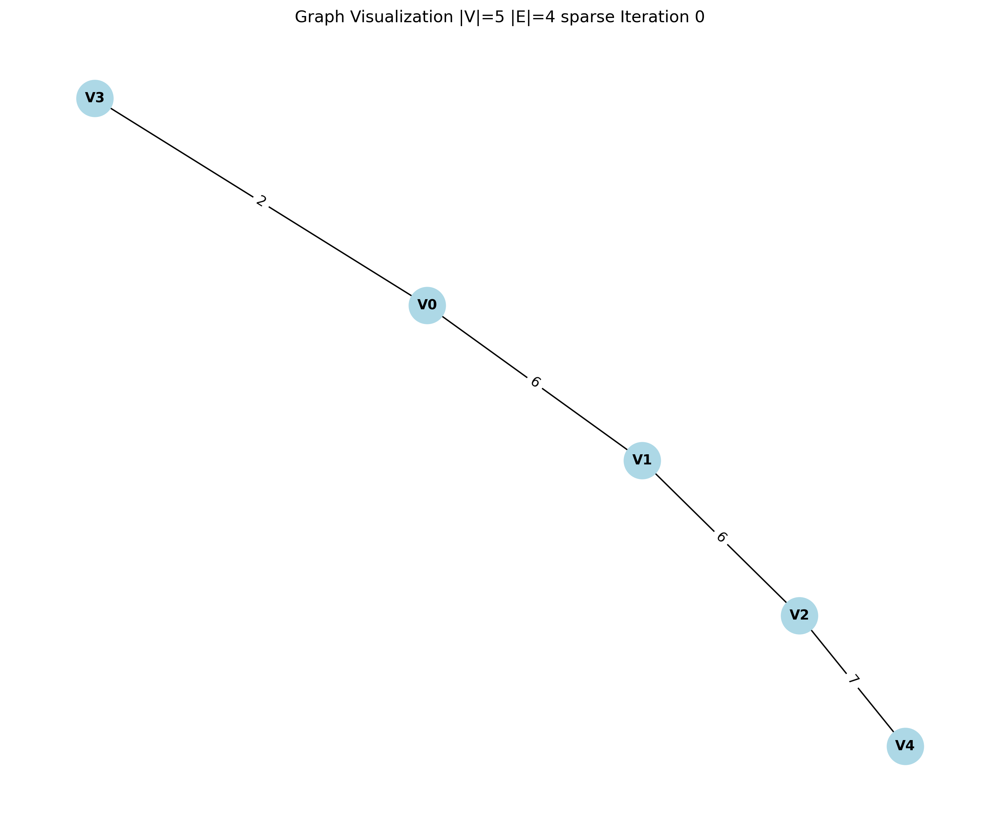
    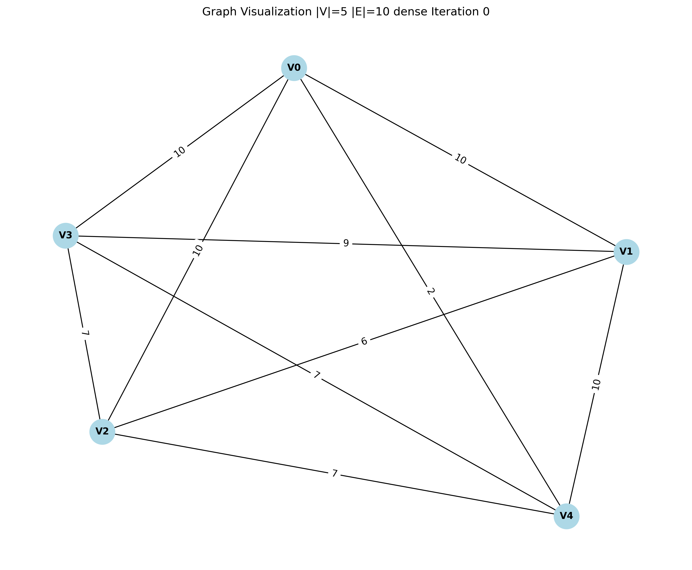

##  Part (a) storing |V| and |E| in an adjacency matrix, and an array for the priority queue

### Theoretical Time Complexity for adjacency matrix and array implementation

The algorithm iterates through each vertex to find the next node with the minimum distance, taking $O(|V|)$ time for each vertex.\
For each vertex it checks all adjacent vertices, with a worst case of $O(|V|)$ in a matrix, Thus overall time complexity is $O(|V|^2)$.
However, the number of edges $E$ does not affect the time complexity because the adjacency matrix forces the algorithm to go through 
all $V$ potential neighbors for each vertex, regardless of whether a graph is sparse or dense, it still needs to go through the whole matrix.

### Example of such a matrix

$$
\begin{pmatrix}
0 & w_{01} & w_{02} & w_{03} \\
w_{10} & 0 & w_{12} & w_{13} \\
w_{20} & w_{21} & 0 & w_{23} \\
w_{30} & w_{31} & w_{32} & 0
\end{pmatrix}
$$

### Empirical Results: Comparing Execution Times and n_operations for adjacency matrix and array implementation, varying $|V|$

    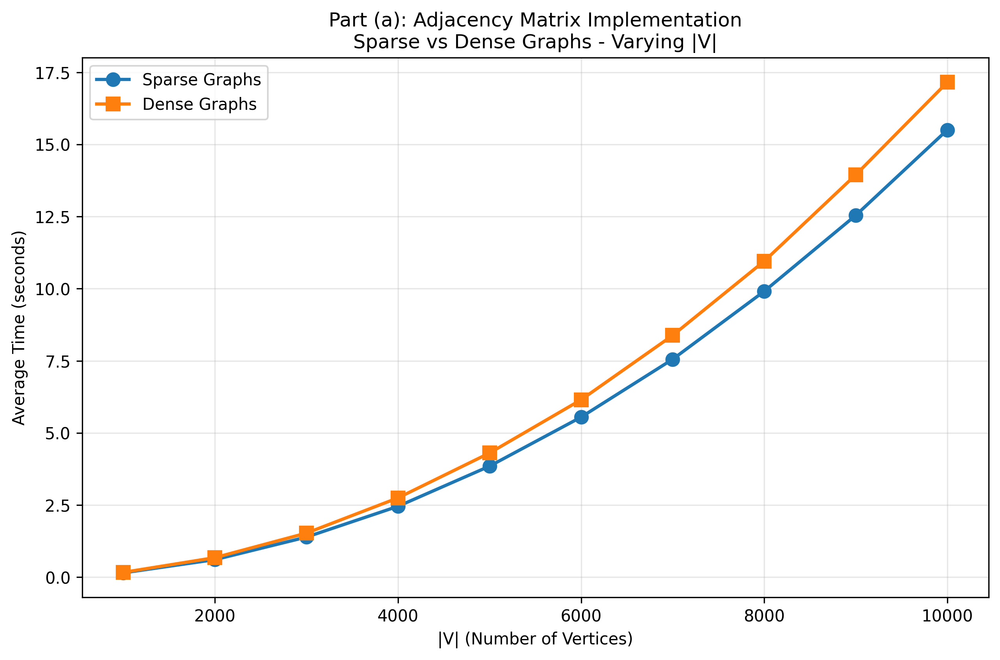
    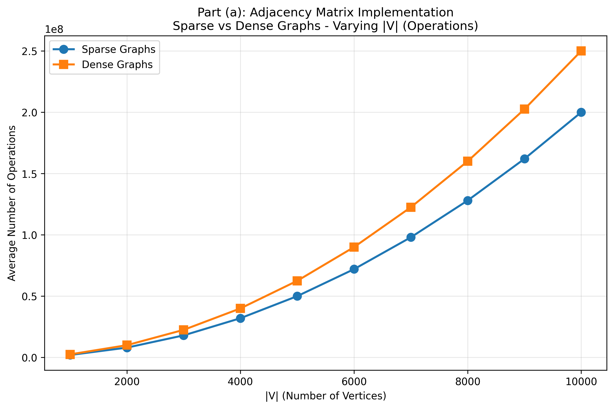

##  Part (b) storing |V| and |E| in an adjacency list, and minimizing heap for priority queue implementation

### Theoretical Time Complexity for adjacency matrix and array implementation

### Empirical Results: Comparing Execution Times and n_operations for adjacency matrix and array implementation varying $|V|$

    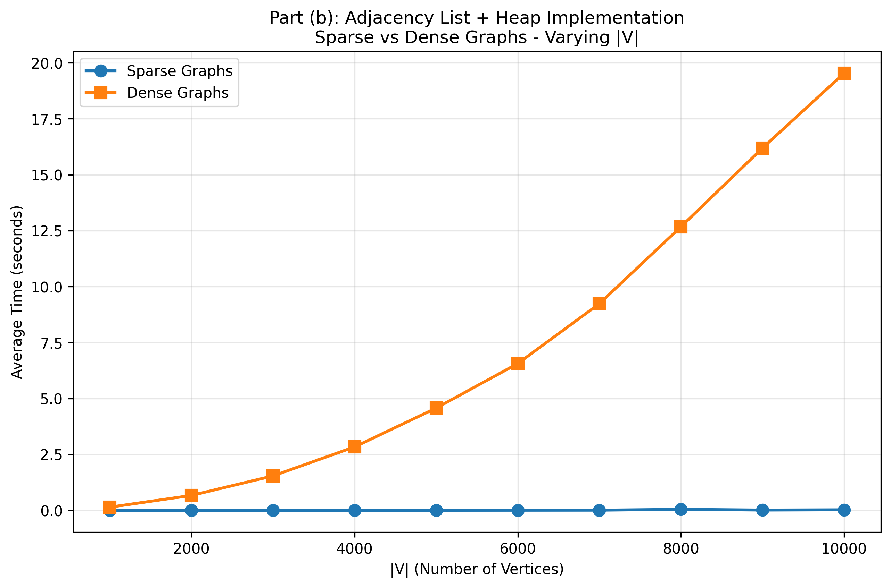
    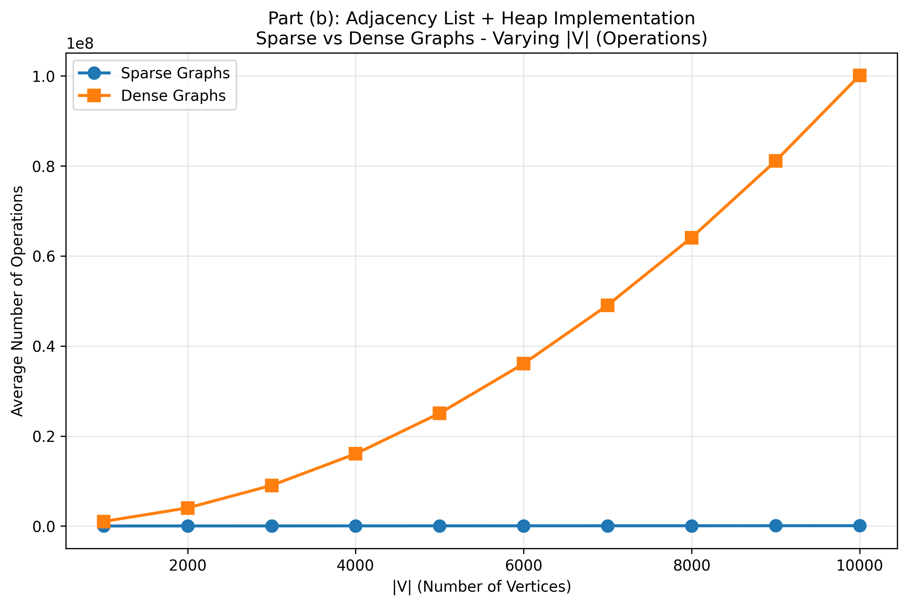

### Empirical Results: Comparing Execution Times and n_operations for adjacency matrix and array implementation using a fixed $|V|$ and varying $|E|$

    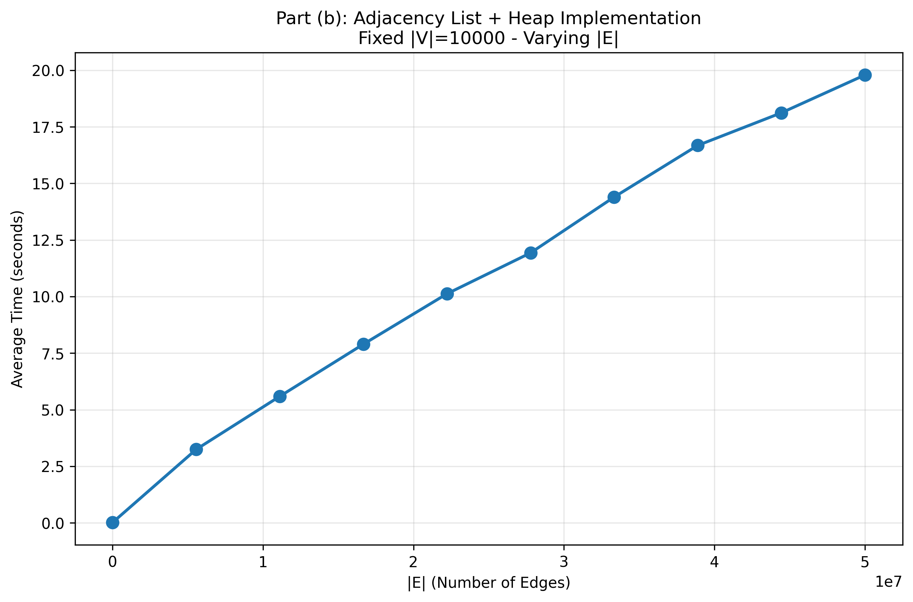
    

### Part (c) Comparison between Adjacency Matrix & Array implementation and Adjacency List & Minimizing Heap implementation

Comparing between the 2 algorithms, we made comparisons with increasing |V| for a set of sparse and dense graphs. 

As we can see, for sparse graphs, the Adjacency List & Minimizing Heap implementation is significantly faster as compared to the Adjacency Matrix & Array implementation with lower number of vertices.

    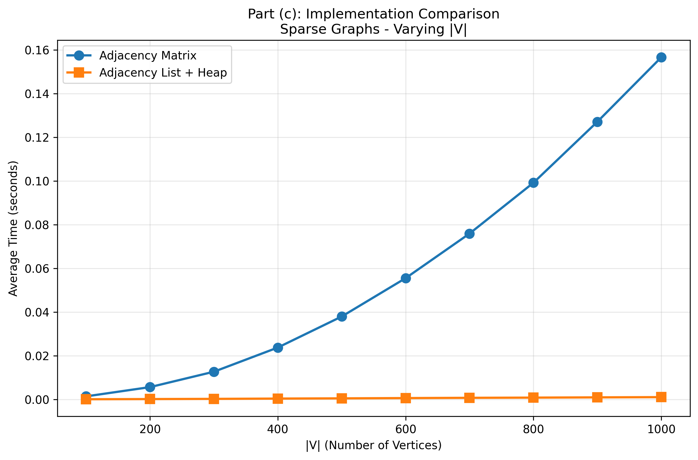
    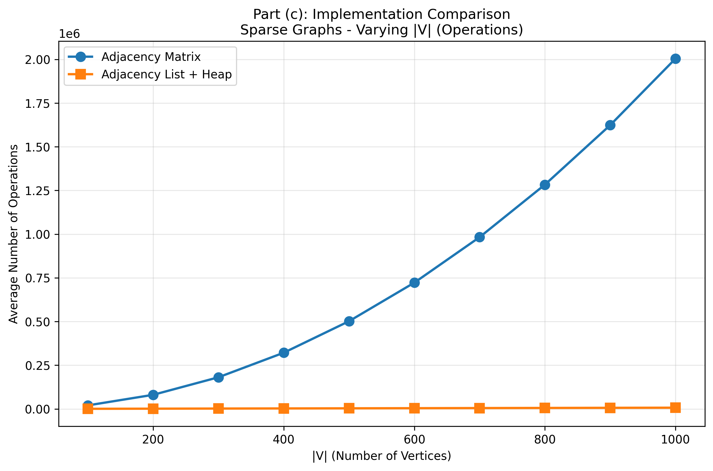

Next, varying |V| for a set of dense graphs, we can see past around 3000 |V|, Adjacency List & Min Heap starts to take longer compared to its Adjacency Matrix & Array counterpart. 

    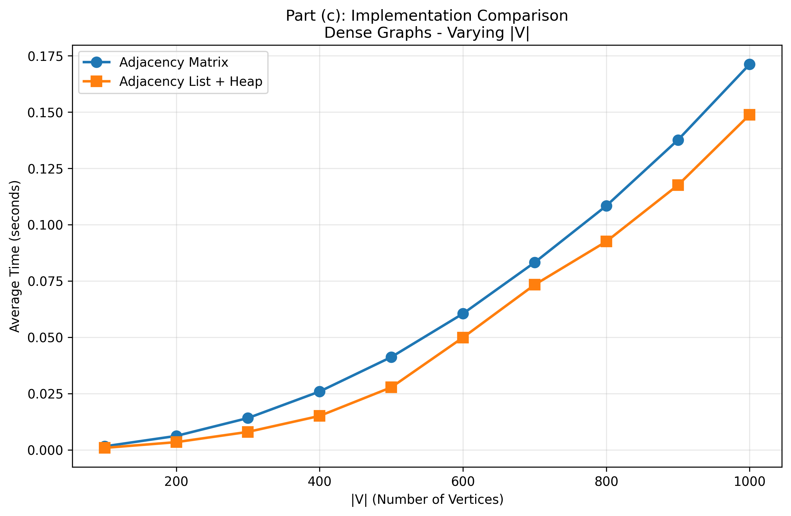
    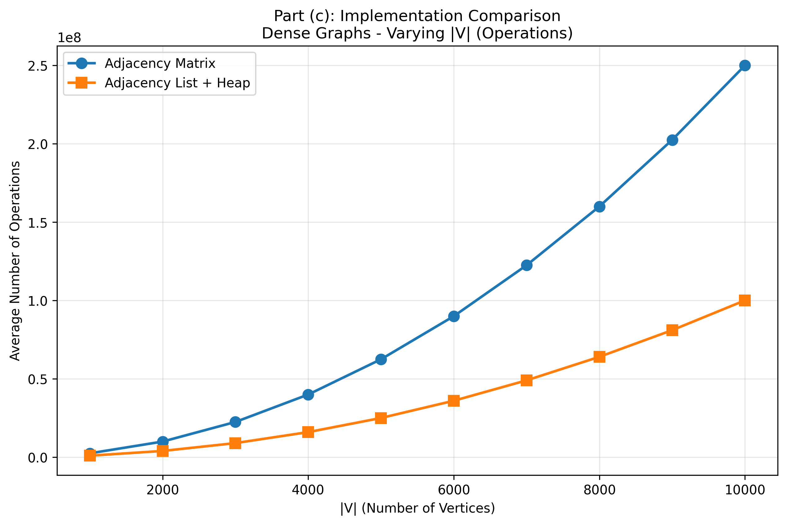

We took a look at having a fixed $|V|$ of 10000 to measure the relationship with respect to the number of edges $|E|$. Both algorithms are compared using graphs with increasing density. The minimum number of edges being $|E| = |V| - 1$ and the maxiumum being $|E| = \frac{|V|(|V| - 1)}{2}$ 

    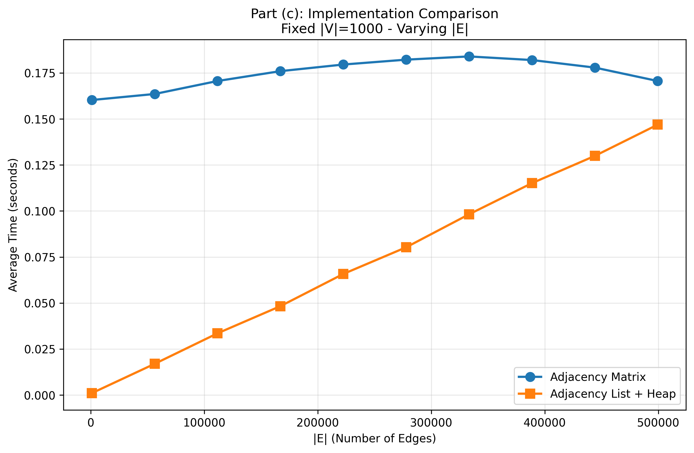
    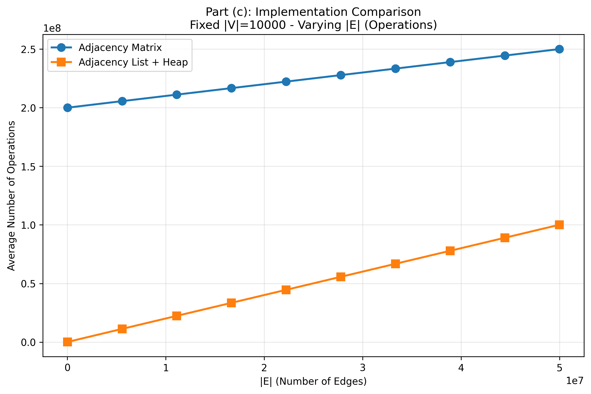

We can conclude that for sparse graphs, Dijkstra's with adjacency list & minimizing heap is significantly faster. As the graph grows denser in the number of edges or past a certain number of vertices, the adjacency matrix & array implmentation should be considered as it becomes more efficient. 

