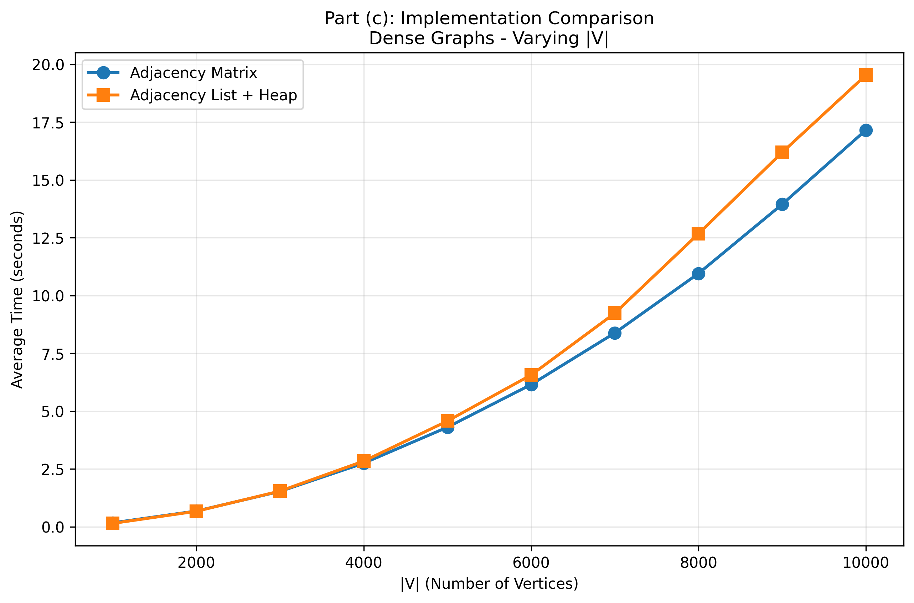
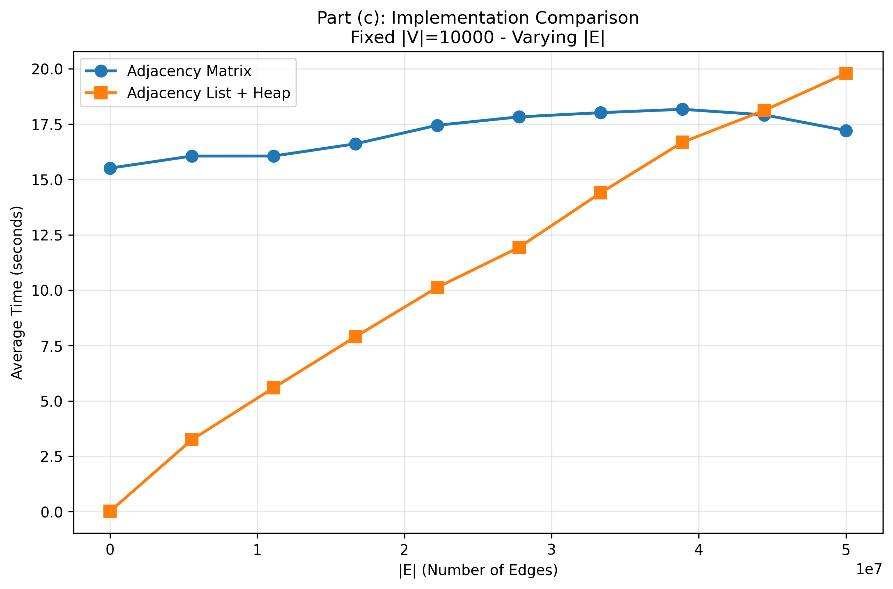

# Project 2: The Dijkstra’s Algorithm

## Generation of graphs
- All graphs are undirected, and we ensured that every vertex is connected to at least one other vertex.
- Python's random library is used to randomly generate the edges and their weights.
- A sparse graph is defined as having edges $|E| = |V| - 1$.
- A "dense" graph is defined as having edges $|E| = \frac{|V|(|V| - 1)}{2}$.
- "dense" in this case refers to a complete graph, that is undirected.
- All timings and "number of operations" in the algorithm are averages from 30 sets of graphs.

### Example of a sparse and dense graph  

    
    

##  Part (a) storing |V| and |E| in an adjacency matrix, and an array for the priority queue

### Theoretical Time Complexity for adjacency matrix and array implementation

For adjacency matrix and array priority queue implementations of Dijkstra's 
algorithm, it works by iterating through each vertex to find the next node with
the minimum distance, taking $O(|V|)$ time for each vertex as it searches the 
entire row to find the minimum distance. For each vertex, it checks all adjacent 
vertices, and in the worst case, this involves scanning up to $|V|$ potential 
neighbors even if the neighbors are not reacheable. Thus number of edges $|E|$ 
does not contribute to the time complexity. Hence, regardless of whether the 
graph is sparse or dense,the total time complexity is $O(|V|^2)$. This makes the
approach less efficient for sparse and moderately dense graphs compared to 
implementations using adjacency lists and heaps.

### Example of such a matrix

$$
\begin{pmatrix}
0 & w_{01} & w_{02} & w_{03} \\
w_{10} & 0 & w_{12} & w_{13} \\
w_{20} & w_{21} & 0 & w_{23} \\
w_{30} & w_{31} & w_{32} & 0
\end{pmatrix}
$$

### Empirical Results: Comparing Execution Times and n_operations for adjacency matrix and array implementation, varying $|V|$

As the number of vertices $|V|$ increases, the execution time grows 
significantly faster for both sparse and dense graphs due to the $O(|V|^2)$ time
complexity. In general, dense graphs take slightly longer to execute, likely due 
to overhead caused by actual edges, which requires the algorithm to update the 
shortest distances.

##  Part (b) storing |V| and |E| in an adjacency list, and minimizing heap for priority queue implementation

### Theoretical Time Complexity for adjacency list, and minimizing heap for priority queue implementation

The min-heap and adjacency list implementations of Dijkstra's algorithm, 
works by iterating through each vertex to find the next node with the minimum 
distance. Since there are $|V|$ vertices and each pop from the priority queue 
takes $O(\log |V|)$ time, the total time for all pop operations is 
$O(|V| \log |V|)$. When traversing each vertex’s neighbors, updating the 
shortest distance to a node does a push operation to the heap which also takes 
$O(\log |V|)$ time per operation. In the worst case, all $|E|$ edges are new 
alternate paths that are shortest each, requiring $|E|$ edges to be pushed 
leading to a total push time of $O(|E| \log |V|)$. Combining both, the overall 
time complexity is $O((|V| + |E|) \log |V|)$.

### Empirical Results: Comparing Execution Times and n_operations for adjacency list, and minimizing heap for priority queue implementation varying $|V|$

As the number of vertices |V| increases, execution time grows significantly 
faster for dense graphs due to the $O(|V|^2 \log |V|)$ time complexity where 
edges $|E| = |V|^2$. For sparse graphs, the adjacency listand min-heap 
implementation remains efficient when $|V|$ increases, with time complexity of 
$O(|V| \log |V|)$ as edges $|E| = |V|$

### Empirical Results: Comparing Execution Times and n_operations for adjacency list, and minimizing heap for priority queue implementation using a fixed $|V|$ and varying $|E|$

To investigate how number of edges $|E|$ affect the algorithm, we fixed number 
of vertices $|V|$ and varied $|E|$. When $|E|$ increases, the graphs become more
and more dense, until $|E| = \frac{|V|(|V| - 1)}{2}$ is reached, the maxmimum 
number of edges. Thus we can see that execution times are positively related 
with number of edges $|E|$ (density) which is in line with the theoretical 
overall time complexity of $O((|V| + |E|) \log |V|)$.

## Part (c) Comparison between Adjacency Matrix & Array implementation and Adjacency List & Minimizing Heap implementation

Comparing between the 2 algorithms, we made comparisons with increasing |V| 
for a set of sparse and dense graphs. 

Time complexity for Adjacency List & Minimizing Heap: $O((V + E) log V)$

Time complexity for Adjacency Matrix & Array: $O(V^2)$

As we can see, for sparse graphs, the Adjacency List & Minimizing Heap 
implementation is significantly faster as compared to the Adjacency Matrix & 
Array implementation. In sparse graphs where number of edges $E ≈ V$, is small
and a time complexity of $O((V + E) log V) ≈ O((V log V)$ for Adjacency List & 
Minimizing Heap, which is faster than $O(V^2)$ for Adjacency Matrix & Array.

Next, varying |V| for a set of dense graphs, we can see past around 3000 |V|, 
Adjacency List & Min Heap starts to take longer compared to its Adjacency Matrix
& Array counterpart. 
In dense graphs, $E ≈ V^2$, thus, $O((V + E) log V) ≈ O((V^2 log V)$ 
for Adjacency List & Minimizing Heap, which is actually worst than $O(V^2)$ for 
Adjacency Matrix & Array.

| Vertices (V) | Matrix Average Time (s) | Heap Average Time (s) |
|--------------|--------------------------|-----------------------|
| 1000         | 0.167056533508003        | 0.143789926730096     |
| 2000         | 0.677438182942569        | 0.667394666746259     |
| 3000         | 1.52760223597288         | 1.5411739166826       |
| 4000         | 2.74832137152553         | 2.8372815715149       |
| 5000         | 4.3039311490953          | 4.57237247973681      |
| 6000         | 6.14998365454376         | 6.56216655708849      |
| 7000         | 8.38204546999186         | 9.23631055541337      |
| 8000         | 10.9556928310543         | 12.6747206885368      |
| 9000         | 13.9498813493177         | 16.1930489379913      |
| 10000        | 17.1582578875124         | 19.5359363546595      |

We also fixed $|V|$ of 10000 to investigate the relationship with respect to the
number of edges $|E|$. Both algorithms are compared using graphs with increasing 
density by varing $|E|$. The minimum number of edges is
$|E| = |V| - 1$ and the maxiumum is $|E| = \frac{|V|(|V| - 1)}{2}$ 

We can conclude that for sparse graphs, Dijkstra's algorithm using adjacency 
list & minimizing heap is significantly faster. As the graph grows denser in 
the number of edges, the adjacency matrix & array implmentation should be 
considered as it becomes more efficient. 

